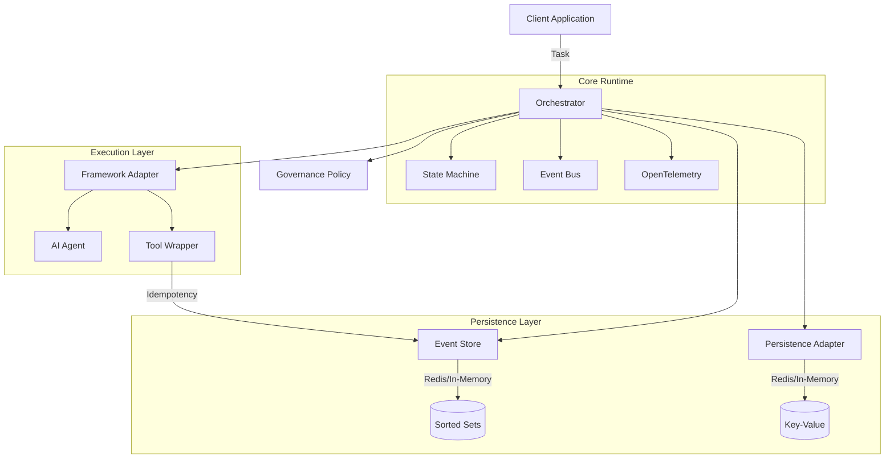
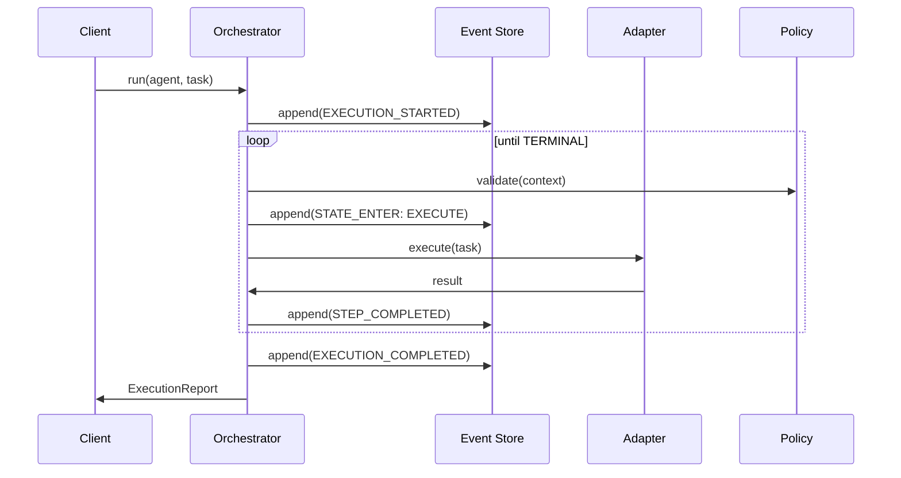
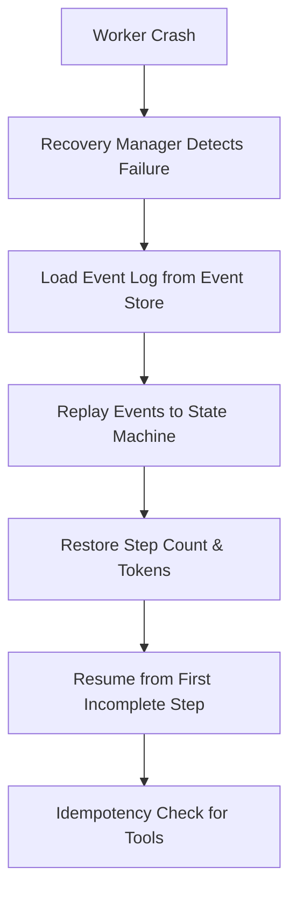
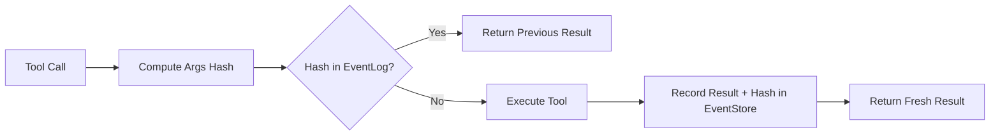

# 🏗️ OAO Architecture

This document details the internal architecture of the Open Agent Orchestrator (OAO), focusing on its deterministic execution model and event-sourced core.

---

## 1. Structural Overview

OAO is built on a modular, adapter-based architecture that decouples agent logic from execution concerns.

---

## 2. Event-Sourced Lifecycle

Every execution follows a strict state-machine driven lifecycle where transitions are recorded as immutable events.

---

## 3. Crash Recovery Flow

OAO guarantees state reconstruction and at-least-once execution via its recovery protocol.

---

## 4. Tool Idempotency Logic

To prevent duplicate side-effects during retries or recovery, OAO hashes tool calls.

